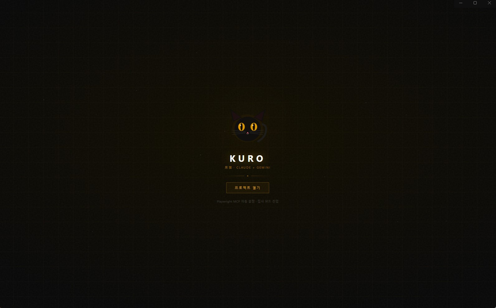
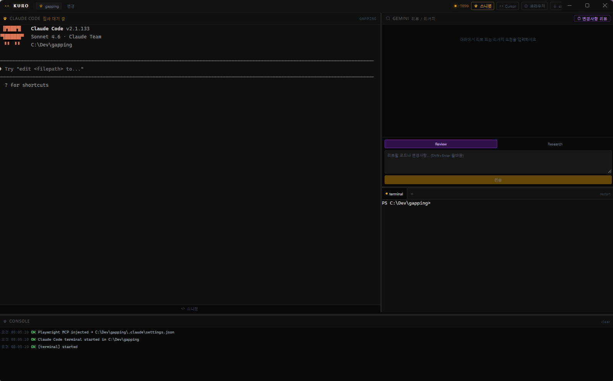
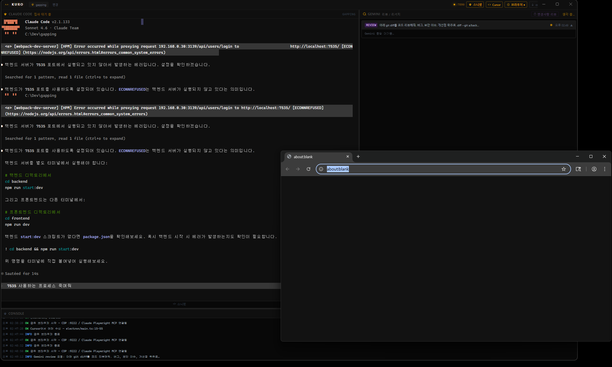
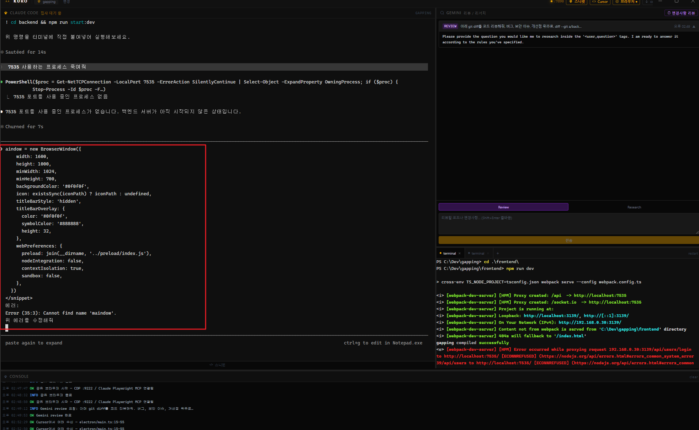
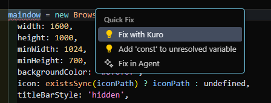

# Kuro

Claude가 코드를 작성하고, Antigravity가 리뷰와 리서치를 담당하는 AI 기반 개발 워크스페이스.  
Electron 데스크탑 앱으로 로컬 프로젝트 개발에 집중할 수 있도록 설계됐다.

---

## 스크린샷

### 시작 화면

> 프로젝트 폴더 선택 전 로딩 화면. Playwright MCP 자동 설정 진행 중.

### 메인 워크스페이스

> 좌측: Claude Code 터미널 (대기 중) / 우측 상단: Antigravity 패널 (변경사항 리뷰 버튼) / 우측 하단: Dev Server 멀티탭 / 하단: 이벤트 콘솔

### 공유 브라우저 + Antigravity 리뷰

> Claude가 코드 분석 중. 우측에 Chrome 공유 브라우저(CDP :9222) 실행, Antigravity 리뷰 완료. Dev Server 탭 두 개 동시 실행.

### Cursor 에러 전송

> Cursor에서 `Ctrl+Alt+K`로 에러+코드 전송. Claude가 자동으로 에러를 분석하고 수정 중.

### Fix with Kuro

> Cursor 에디터 전구(💡) 메뉴 또는 `Ctrl+Alt+K`로 "Fix with Kuro" 실행.

---

## 화면 구성

```
┌──────────────────────────────────────────────────────────────────────────────┐
│  Kuro  [프로젝트명]  [변경]   스니펫  Cursor  브라우저  compact  Claude ● Dev ●  │  ← 툴바
├──────────────────────────────────┬───────────────────────────────────────────┤
│                                  │  Antigravity 리뷰/리서치  [변경사항 리뷰]  │
│                                  │  ┌─────────────────────────────────────┐  │
│   Claude Code                    │  │ [REVIEW] git diff 리뷰 요청…        │  │
│   (xterm.js PTY)                 │  │ ## Verdict                          │  │
│                                  │  │ ● SHIP                              │  │
│   claude 자동 실행               │  └─────────────────────────────────────┘  │
│   인터랙티브 터미널              ├───────────────────────────────────────────┤
│                                  │  Dev Server  [+ 탭]  [탭1] [탭2] …       │
│                                  │  멀티탭 터미널 (front/back 동시 실행)     │
│                                  │  (xterm.js PTY)                          │
├──────────────────────────────────┴───────────────────────────────────────────┤
│  Console  13:42:01 OK   Playwright MCP injected…                             │  ← 이벤트 로그
└──────────────────────────────────────────────────────────────────────────────┘
```

4개 패널은 드래그로 자유롭게 리사이즈된다.

---

## 설치

```powershell
git clone <repo>
cd Kuro
npm install
```

`npm install` 시 `node-pty`가 현재 Electron 버전에 맞게 자동으로 네이티브 빌드된다.

### 사전 요구사항

| 도구 | 용도 | 확인 |
|------|------|------|
| Node.js 18+ | 빌드 및 런타임 | `node --version` |
| Claude Code CLI | 메인 코더 터미널 | `claude --version` |
| Antigravity CLI (agy) | 리뷰/리서치 | `agy --version` |
| Git | 변경사항 리뷰 (git diff) | `git --version` |

---

## 실행

```powershell
# 개발 모드 (핫리로드 + DevTools 자동 오픈)
npm run dev

# 프로덕션 빌드
npm run build

# Windows NSIS 인스톨러 (.exe) 생성
npm run package
```

---

## Cursor 확장 설치

에러를 Kuro로 직접 전송하는 Cursor/VS Code 확장이다.

```powershell
cd cursor-extension
npm run build
npx @vscode/vsce package --no-dependencies
# Cursor: Ctrl+Shift+P → Extensions: Install from VSIX → kuro-cursor-0.1.0.vsix 선택
```

| 동작 | 방법 |
|------|------|
| 에러+코드 전송 | 에러 위치에 커서 두고 `Ctrl+Alt+K` |
| 선택 코드 전송 | 코드 선택 후 커맨드 팔레트 → `Kuro: 선택한 코드 전송` |
| Quick Fix 메뉴 | 에러 줄 전구(💡) 클릭 → `Fix with Kuro` |

Kuro 앱이 실행 중이어야 동작한다 (포트 7890).

---

## 동작 흐름

### 1. 프로젝트 열기

앱 실행 시 프로젝트 폴더를 선택한다. 이 시점에 두 가지가 자동으로 처리된다.

**Dev Server 자동 감지**  
선택한 폴더의 `package.json`을 읽어 실행 가능한 스크립트를 탐색한다.

```
dev → start → serve → preview 순으로 탐지
```

감지된 명령어는 Dev Server 패널에 자동 입력된다.

**Playwright MCP 자동 주입**  
`.claude/settings.json`에 Playwright MCP 서버를 머지한다.  
기존 설정은 덮어쓰지 않고 `mcpServers.playwright` 키만 추가/갱신한다.

```json
// .claude/settings.json (자동 생성/갱신)
{
  "mcpServers": {
    "playwright": {
      "command": "npx",
      "args": ["@playwright/mcp@latest", "--headless"],
      "type": "stdio"
    }
  }
}
```

### 2. Claude Code 패널

`node-pty`로 PowerShell PTY를 생성하고 `claude`를 자동 실행한다.

```
PowerShell 스폰 → -NoExit -Command claude → Claude Code 인터랙티브 세션 시작
```

Claude Code는 `~/.claude.json`의 `mcpServers.playwright`를 읽어 Playwright MCP와 연결되므로,  
별도 설정 없이 `browser_*` 도구를 바로 사용할 수 있다.

**터미널 우클릭 메뉴:**

| 항목 | 동작 |
|------|------|
| 복사 | 선택 영역 클립보드 복사 |
| 붙여넣기 | 클립보드 내용 터미널에 입력 |
| Claude로 전송 | 선택 영역을 Claude 터미널에 입력 |
| Antigravity로 전송 | 선택 영역을 Antigravity 입력창에 자동 삽입 |

**Playwright MCP로 가능한 디버깅:**

```
browser_navigate      → 특정 URL 열기
browser_screenshot    → 현재 화면 캡처
browser_console_messages → 콘솔 에러/경고 수집
browser_click         → 버튼/링크 클릭 테스트
browser_fill          → 입력창 값 입력
browser_network_requests → API 요청/응답 확인
```

Claude가 코드를 수정한 뒤 직접 브라우저를 열어 결과를 확인하고,  
콘솔 에러를 읽어 다시 수정하는 사이클을 자율적으로 반복할 수 있다.

### 3. Dev Server 패널

**멀티탭** 구조로 여러 서버를 동시에 실행할 수 있다 (front, back 등).  
감지된 명령어(`npm run dev` 등)는 첫 번째 탭에 자동 실행된다.  
`+` 버튼으로 탭 추가, 각 탭은 독립적인 PTY를 가진다.

프로세스 종료 시 Windows에서 자식 프로세스까지 `taskkill /F /T`로 정리한다.

### 4. 공유 브라우저 (CDP)

툴바 **브라우저** 버튼을 클릭하면 Chrome을 `--remote-debugging-port=9222`로 실행한다.  
Playwright MCP가 동일한 브라우저 인스턴스에 연결되므로 Claude와 사용자가 같은 화면을 공유한다.

이미 실행 중인 Chrome CDP가 감지되면 새로 띄우지 않고 연결만 한다.  
MCP 설정에 `--cdp-endpoint`가 자동으로 갱신된다.

### 5. Antigravity 패널

**Review 모드**와 **Research 모드** 두 가지를 제공한다.

#### Review — 코드 리뷰

```
입력: 리뷰할 코드 또는 변경사항 설명
출력: Verdict (SHIP / NEEDS-FIX / DISCUSS) + Findings
```

Antigravity가 다음 형식으로 응답한다:

```
## Verdict
NEEDS-FIX

## Findings
Major — src/auth/login.ts:42 — password가 평문으로 로그에 출력됨
Minor — src/api/user.ts:18 — 입력값 검증 누락

## What I checked
- 인증 로직, 입력 처리, 에러 핸들링
```

verdict 결과는 색상으로 표시된다:  
`● SHIP` (초록) / `● NEEDS-FIX` (빨강) / `● DISCUSS` (노랑)

#### Research 모드

```
입력: 조사할 기술 질문
출력: 직접 답변 + 출처(URL, 버전, 공식 문서)
```

예시 활용:
- "React 19에서 useEffect 클린업 변경사항은?"
- "Vite 6 breaking changes 목록"
- "node-pty Windows ConPTY 지원 버전"

**응답 스트리밍**  
Antigravity CLI(agy)의 stdout을 라인 단위로 읽어 실시간으로 패널에 표시한다.  
응답이 완료되면 로딩 인디케이터가 사라지고 카드가 확정된다.

각 요청은 접기/펼치기 가능한 카드로 쌓여 히스토리처럼 탐색할 수 있다.

**변경사항 리뷰 버튼:**  
Claude가 코드를 수정한 후 **변경사항 리뷰** 클릭 → `git diff HEAD` 자동 실행 → diff가 Antigravity 입력창에 채워짐 → 전송하면 리뷰 시작.  
미커밋 변경사항이 없으면 마지막 커밋(`git show HEAD`)으로 자동 대체된다.

### 6. Console 패널

앱 내부 이벤트를 타임스탬프와 함께 기록한다.

```
13:42:01  OK    Playwright MCP injected → C:\project\.claude\settings.json
13:42:02  OK    Claude Code terminal started in C:\project
13:42:03  OK    Dev server terminal started
13:45:10  INFO  Antigravity review 요청: 로그인 로직 변경사항…
13:45:18  OK    Antigravity review 완료
13:52:33  WARN  Dev server exited (code 1)
```

`clear` 버튼으로 초기화할 수 있다.

---

## 내부 구조

```
Kuro/
├── electron/
│   ├── main.ts          # IPC 핸들러 (PTY, MCP, Antigravity, 브라우저, git, HTTP 서버)
│   └── preload.ts       # contextBridge — renderer ↔ main 브릿지
├── src/
│   ├── components/
│   │   ├── layout/MainLayout.tsx     # CSS Grid 4-패널 + 3-핸들 리사이즈
│   │   ├── panels/
│   │   │   ├── ClaudePanel.tsx       # xterm.js + PTY 'claude' + 외부 inject 수신
│   │   │   ├── AgyPanel.tsx          # 리뷰/리서치 UI + 스트리밍 + git diff 리뷰
│   │   │   ├── DevServerPanel.tsx    # 멀티탭 xterm.js PTY
│   │   │   └── ConsolePanel.tsx      # 이벤트 로그 뷰
│   │   ├── toolbar/Toolbar.tsx       # 툴바 (브라우저, Cursor, compact 등)
│   │   ├── TermContextMenu.tsx       # 터미널 우클릭 컨텍스트 메뉴
│   │   └── ProjectLoadScreen.tsx     # 초기 폴더 선택 화면
│   ├── store/useAppStore.ts          # Zustand 전역 상태
│   └── types/electron.d.ts          # Window.kuro IPC 타입 선언
├── cursor-extension/
│   └── src/extension.ts             # Cursor/VS Code 확장 (에러 → Kuro 전송)
└── scripts/
    ├── ask-agy.ps1                  # Antigravity CLI (agy) 래퍼 PowerShell 스크립트
    └── gen-icon.js                  # SVG → PNG → ICO 아이콘 생성
```

### IPC 구조

```
Renderer (React)
    │
    │  window.kuro.* (contextBridge)
    ▼
Preload (preload.ts)
    │
    │  ipcRenderer.invoke / ipcRenderer.on
    ▼
Main Process (main.ts)
    │
    ├─ node-pty        → Claude/Dev Server 터미널 (PTY)
    ├─ child_process   → Antigravity CLI (agy) PowerShell 스크립트 / git diff / tasklist
    ├─ http.createServer → HTTP :7890 (Cursor 확장 수신)
    ├─ child_process   → Chrome CDP 브라우저 실행
    ├─ fs              → ~/.claude.json MCP 주입
    └─ dialog          → 폴더 선택 네이티브 대화상자
```

### Cursor 확장 → Kuro 흐름

```
Cursor (kuro.fixWithKuro)
    │  HTTP POST localhost:7890/inject
    │  { code, error, file, lines }
    ▼
Kuro HTTP Server (main.ts)
    │  webContents.send('external:inject', payload)
    ▼
ClaudePanel.tsx (onExternalInject)
    │  파일: ... (줄)
    │  <snippet file="..." lines="...">...</snippet>
    │  에러: ...
    │  위 에러를 수정해줘
    ▼
PTY 'claude' (Claude Code 터미널에 입력)
```

### PTY 흐름

```
[Main] node-pty.spawn('powershell.exe')
    ↓ onData
[Main] webContents.send('pty:data', { id, data })
    ↓ IPC
[Renderer] xterm.write(data)          ← 화면 출력

[Renderer] term.onData(input)
    ↓ ipcRenderer.send
[Main] pty.write(input)               ← 키입력 전달
```

### Antigravity 호출 흐름

```
[Renderer] window.kuro.agyInvoke({ mode, input })
    ↓
[Main] node-pty.spawn('powershell.exe', ['-File', 'ask-agy.ps1'])
    │  stdin ← JSON.stringify({ mode, input, context })
    │
    │  stdout (스트리밍)
    ├─→ webContents.send('agy:stream', chunk)  ← 실시간 표시
    │
    └─ close → resolve({ success, output, error })
```

---

## Antigravity CLI (agy) 설정

`scripts/ask-agy.ps1`의 마지막 줄이 Antigravity CLI를 호출한다.

```powershell
# 기본 (프롬프트 플래그)
agy -p $prompt

# fallback (stdin 파이프)
$prompt | agy
```

CLI 버전에 따라 플래그가 다를 수 있다. `agy --help`로 확인 후 조정한다.

---

## 스택

| 레이어 | 기술 |
|--------|------|
| 데스크탑 셸 | Electron 31 |
| 빌드 | electron-vite + Vite 5 |
| UI | React 19 + TypeScript |
| 스타일 | Tailwind CSS v3 |
| 상태 관리 | Zustand 5 |
| 터미널 | xterm.js v5 (`@xterm/xterm`) |
| PTY | node-pty 1.x (Windows ConPTY) |
| AI - 코더 | Claude Code CLI (PTY) |
| AI - 리뷰/리서치 | Antigravity CLI `agy` (child_process) |
| 브라우저 자동화 | Playwright MCP (`@playwright/mcp`) |
